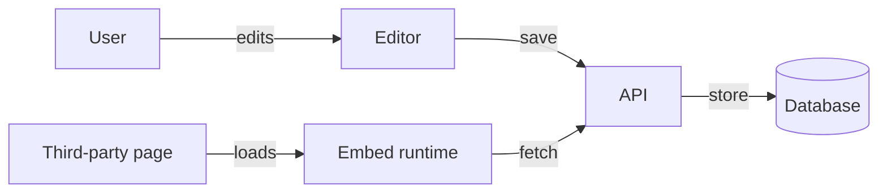

# Project Proposal: Widget Platform

## Overview

This document describes the plan to build a **widget platform** that lets users
create, share, and embed interactive widgets. The platform targets small teams
who need lightweight dashboards without standing up a full BI tool.

## Goals

- Ship an MVP in six weeks.
- Support at least three widget types: chart, table, and counter.
- Allow embedding via a simple `<script>` snippet.

## Architecture

The system has three components:

1. **Editor** — a React app where users compose widgets.
2. **API** — a Node service that stores widget definitions.
3. **Embed runtime** — a small bundle loaded on third-party pages.

```js
// Example embed snippet
<script src="https://widgets.example.com/embed.js"
        data-widget="abc123"></script>
```

## Open Questions

- Should we support real-time data sources in the MVP, or defer to v2?
- What is the pricing model — per seat, per widget, or usage based?

## Data Flow



## Capacity Model

We estimate request load with $\lambda = N \cdot r$, where $N$ is the number of
embedded widgets and $r$ the average refresh rate. Expected monthly cost:

$$
C = \sum_{i=1}^{n} \lambda_i \cdot c_i + C_{\text{fixed}}
$$

## Timeline

| Week | Milestone            |
|------|----------------------|
| 1-2  | Editor skeleton      |
| 3-4  | API + persistence    |
| 5    | Embed runtime        |
| 6    | Polish & launch      |
